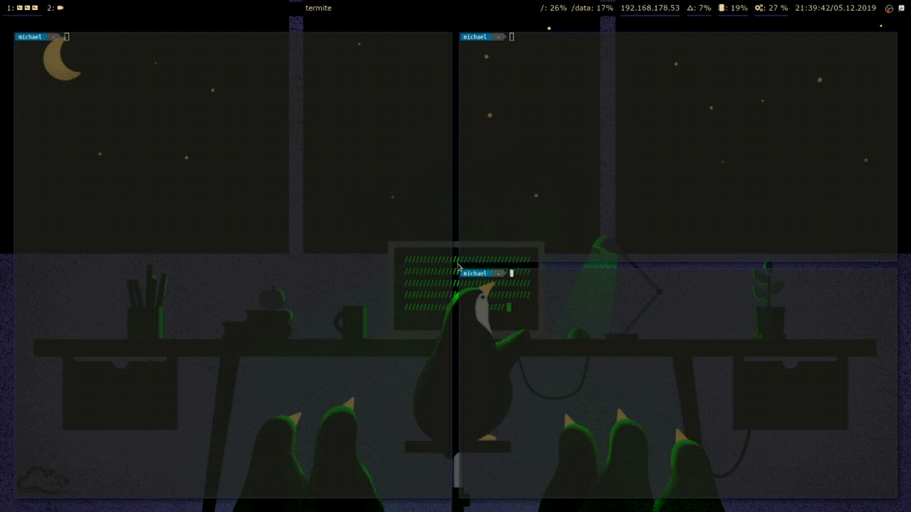

# nogaps
toggle fancy gui stuff

## Demo



## install
```
git clone https://github.com/micmine/nogaps
cd nogaps/
sudo ln -s (pathtofolder)/nogaps.sh /usr/local/bin/nogaps
```

## dependencies
i3-gaps https://github.com/Airblader/i3 <br>
polybar https://github.com/polybar/polybar <br>
compton https://github.com/chjj/compton <br>
